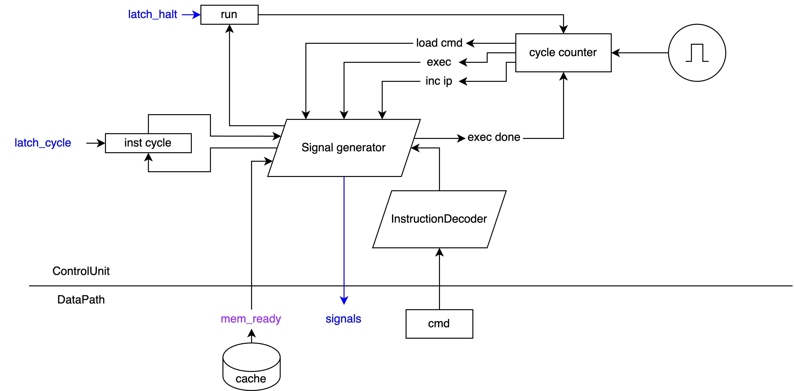
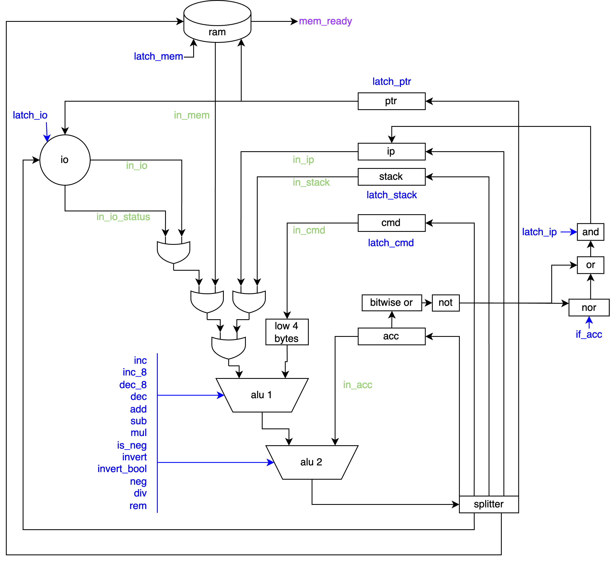
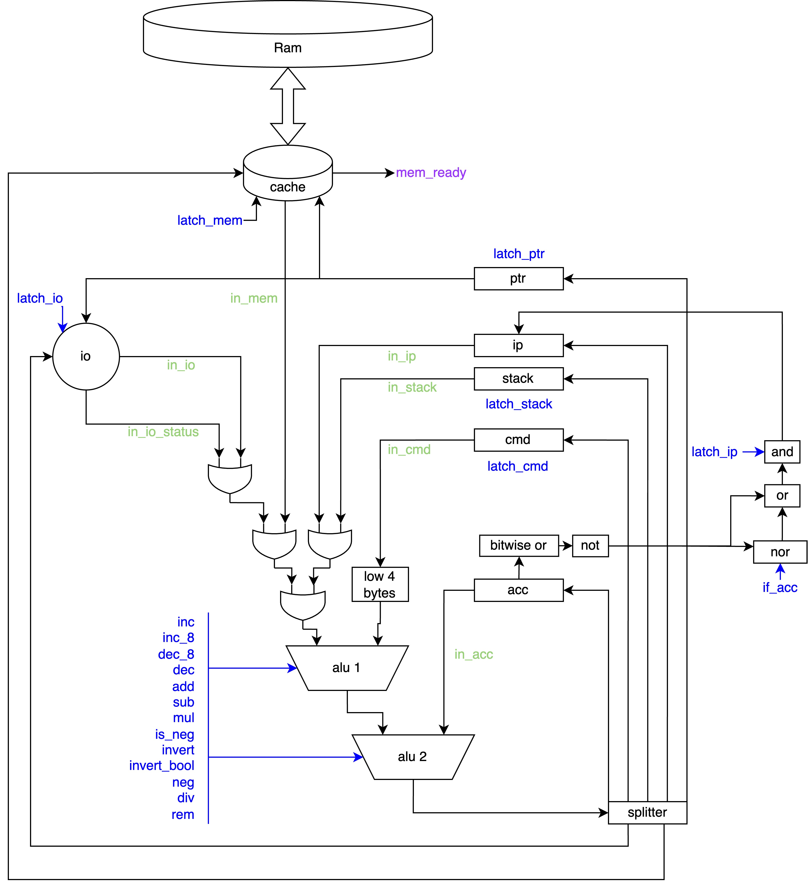

# CSA-lab3

Мацюк Владимир Николаевич, P3215

```txt
lisp -> asm | acc | neum | hw | instr | struct | stream | port | pstr | prob2 | cache
```

Базовый вариант

## Язык программирования

### Описание синтаксиса

```bnf
<program> ::= <exp>

<exp> ::= "(" | <exp>*
              | <function>
              | <import-exp>
              | <exp-exp>
              | <let-exp>
              | <def-exp>
              | <set-exp>
              | <literal>
              | <identifier>
              | <function-call>
              | <operator-exp>
              | <if-exp>
              | <while-exp> ")"

<import-exp> ::= "import" <string>
<function> ::= "fn" <identifier> <parameter>* <type>? <exp>
<parameter> ::= "(" <identifier> <type> ")"
<type> ::= "int" | "str" "*"*
<let-exp> ::= "let" <identifier> <exp>
<def-exp> ::= "def" <identifier> <exp>
<set-exp> ::= "set" <identifier> <exp>
<literal> ::= <numeric> | <string>
<function-call> ::= <identifier> <exp>*
<operator-exp> ::= <bin-op> | <un-op>
<bin-op> ::= <bin-operator> <exp> <exp>
<un-op> ::= <operator> <exp>
<operator-exp> ::= <operator> <exp> <exp>
<bin-operator> ::= "+" | "-" | "*" | "/" | "=" | "%"
<un-operator> ::= "*" | "->" | "." | "-" | "+"
<if-exp> ::= "if" <exp> <exp> <exp>
<while-exp> ::= "while" <exp> <exp>

<identifier> ::= "'"? <character> <identifier-char>*
<numeric> ::= <digit>+
<string> ::= "\"" <string-character>* "\""
<identifier-char> ::= <character> | <digit>
<character> ::= "a" | "b" | ... | "z" | "A" | "B" | ... | "Z" | "_"
<digit> ::= "0" | "1" | ... | "9"
<string-character> ::= <character> | <digit> | <escape-sequence> | " "
<escape-sequence> ::= "\n" | "\\"
```

### Описание семантики

Программа организована в виде последовательности выражений, где каждое выражение обладает возвращаемым значением и ассоциированным с ним типом. Типы данных в языке могут быть базовыми (например, `int`, `char`), указателями на другие типы (например, `int*`), составными (например, `str`), или функциональными (например, `(int, str) -> int`). Составные типы представляют собой коллекции других типов и предоставляют доступ к своим элементам через идентификаторы. Например, тип `str` состоит из указателя на символы (`ptr char*`) и длины строки (`len in`t). Специальный тип `void`/`()` указывает на отсутствие возвращаемого значения и имеет размер 0. Все типы, за исключением `()`, имеют фиксированный размер больше нуля.

- Стратегия вычислений: Вычисления в языке следуют стратегии "вызова по значению", где аргументы функций вычисляются перед передачей в функцию. Эта стратегия обеспечивает предсказуемость выполнения кода за счет явного контроля времени и порядка вычислений.

- Области видимости: Язык поддерживает блочную область видимости: переменные, объявленные внутри блока (например, функции или условного выражения), доступны только в пределах этого блока, и его потомках. Области видимости вложенных блоков могут перекрываться, при этом внутренние блоки могут скрывать переменные с тем же именем из внешних блоков.

- Типизация: Язык строго типизирован, что означает необходимость явного указания типов переменных и функций. Система типов включает проверку типов на этапе компиляции, что способствует выявлению ошибок до выполнения программы.

- Виды литералов: Литералы в языке представляют базовые значения, такие как числа (42, 3.14), символы ('a'), строки ("hello"), и булевы значения (true, false). Литералы могут быть непосредственно использованы в выражениях без предварительного объявления.

- Виды выражений:

  - Пустые `()`: Эти выражения не выполняют никаких действий и возвращают специальное значение (), обозначающее "пустоту" или отсутствие результата. Используются для завершения ветвей выполнения, где результат не требуется.

  - Составные `(() () ... ())`: Составные выражения позволяют группировать несколько выражений в одно, где возвращаемое значение определяется последним выражением в группе. Это позволяет создавать сложные логические и вычислительные конструкции, где каждое действие влияет на конечный результат.

    - Пример:

    ```lisp
    (fn print (s str)
      ((print_str(s))
      (nl)))
    ```

    Здесь `print` вызывает функцию `print_str` для печати строки, за которой следует вызов `nl` для печати новой строки. Возвращаемое значение определяется выражением `(nl)`.

  - Условные `(if cond t f)`: Выбирает между `t` и `f` в зависимости от булева значения `cond`. Это позволяет реализовывать логику ветвления и принятия решений в программе.

    - Пример:

      ```lisp
      (fn factorial (n int) int
        (if (= n 0) 1 (* n (factorial (- n 1)))))
      ```

      Функция factorial использует условное выражение для проверки базового случая рекурсии: если n равно 0, возвращает 1; в противном случае рекурсивно вызывает себя.

  - Циклы `(while cond body)`: Выполняет `body` пока `cond` истинно, возвращая значение последней итерации.

    - Пример:

      ```lisp
      (fn print_n (n int)
        ...
        (while cur (
          (print_byte (+ (% (/ n cur) base) zero))
          (set cur (/ cur base)) ))
        ...)
      ```

  - Определение и присваивание переменных: `(let var val)`: Объявляет новую переменную `var` и инициализирует её значением `val`. Это выражение используется для создания локальных переменных с начальным значением.

    - Пример: `(let x 10)` создаёт переменную `x` с начальным значением `10`.

  - `(set var val)`: Присваивает переменной `var` новое значение `val`. Применяется для изменения значения уже существующих переменных.

    - Пример: `(set x 20)` изменяет значение переменной `x` на `20`.

  - Импорт модулей: `(import "path")`: Подключает модуль или библиотеку, расположенную по указанному пути `"path"`. Это выражение позволяет использовать функции, переменные и типы, определённые в других файлах или библиотеках.

    - Пример: `(import "./math")` импортирует модуль `math` из текущей директории.

  - Оператор доступа к члену структуры: `.` и `->`: Используется для доступа к полям структуры или элементам объекта. Оператор `.` используется для прямого доступа с разыменованием, тогда как `->` возвращает указатель.

    - Пример: `(-> ptr id)` обращается к полю `id` структуры, на которую указывает `ptr`.

  - Операторы: Используются для выполнения арифметических, логических и других операций над данными. Включают в себя стандартные операторы, такие как `+`, `-`, `*`, `/`, `%` для арифметики, и `=`, `!=` для сравнения.

    - Арифметические операторы:

      - `+`: Сложение двух чисел.
      - `-`: Вычитание двух чисел.
      - `*`: Умножение двух чисел.
      - `/`: Деление двух чисел.
      - `%`: Остаток от деления двух чисел.

    - Логические операторы:
      - `=`: Проверка на равенство.
      - `!=`: Проверка на неравенство.

    Примеры:

    - `(+ a b)`: Возвращает сумму `a` и `b`.
    - `(/ a b)`: Возвращает результат деления `a` на `b`.

## Организация памяти

В разработанном эмуляторе процессора внимание уделяется эффективному управлению памятью, с особым акцентом на работу с регистрами и оперативной памятью. В основе эмулятора лежит 64-битная архитектура, что обуславливает использование 64-битных регистров для выполнения операций и хранения данных.

### Регистры процессора

Для управления процессом выполнения программы и обработки данных предусмотрены следующие регистры:

- acc (Accumulator): Регистр аккумулятора, используемый для хранения промежуточных вычислительных результатов.
- ip (Instruction Pointer): Указатель инструкций, хранит адрес текущей выполняемой инструкции в оперативной памяти.
- ptr (Pointer): Универсальный указатель, предназначенный для доступа к оперативной памяти. Значение в ptr определяет, откуда будет загружено или куда будет сохранено значение при доступе к памяти.
- cmd (Command): Регистр команд, содержит текущую исполняемую инструкцию, загруженную из памяти по адресу, указанному в ip.
- stack: Служебный регистр для работы со стековой памятью, хранит адрес вершины стека для текущего контекста выполнения.

### Флаги управления

- run: Логический флаг, управляющий выполнением эмулятора. При установке в true программа продолжает выполнение, в false — останавливается.

### Оперативная память

Оперативная память эмулятора подразделяется на две основные области:

Глобальная память: Начинается с адреса 0x00 и расширяется вверх. В этой области размещаются исполняемые инструкции программы и константы. Доступ к глобальной памяти осуществляется через установку соответствующего адреса в регистр ptr.

Стековая память: Организована так, что начинается с максимально доступного адреса и расширяется вниз. Стек используется для динамического выделения памяти, в том числе для хранения адресов возврата из функций, локальных переменных и параметров вызова. Для управления стековой памятью служит регистр stack, указывающий на текущую вершину стека.

### Работа с памятью

Для выполнения операций с памятью необходимо установить адрес в регистре ptr. После этого, при любом обращении к памяти, будет происходить загрузка или запись данных по указанному адресу. Таким образом, взаимодействие с памятью реализуется через комбинацию регистра ptr и операций чтения/записи.

### Стековая память

В процессе работы программы особое внимание уделяется управлению стековой памятью. Стековая память организована таким образом, что в начале выделяется место для хранения возвращаемого значения блока. После этого аллоцируется пространство для локальных переменных функции. Затем, в соответствии с вложенностью выражений и блоков кода, выделяются дополнительные сегменты памяти.

Когда выполнение программы доходит до вложенного выражения или блока кода, память для него выделяется поверх уже существующей стековой памяти. Если вложенных блоков несколько и они выполняются последовательно, то после завершения каждого из них занимаемая им память может быть переиспользована для следующего блока.

### Пример организации стековой памяти блоков

Предположим, у нас есть стек с адресом начала 0x0000000000010000. Рассмотрим, как будет выглядеть распределение памяти при выполнении определённого блока кода:

| Address  | User          | Owner  |
| -------- | ------------- | ------ |
| `0xffc0` | `child_var_n` | child  |
| `0xffc8` | `child_var_2` | child  |
| `0xffd0` | `child_var_1` | child  |
| `0xffd8` | `child_ret`   | child  |
| `0xffe0` | `var_n`       | scope  |
| `0xffe8` | `var_2`       | scope  |
| `0xfff0` | `var_1`       | scope  |
| `0xfff8` | `ret`         | return |

При вызове блока, если его возвращаемое значение используется в другом выражении память будет переиспользована.

| Address  | User               | Owner  |
| -------- | ------------------ | ------ |
| `0xffc0` |                    | child  |
| `0xffc8` | `child_var_n`      | child  |
| `0xffd0` | `child_var_2`      | child  |
| `0xffd8` | `child_var_1`      | child  |
| `0xffe0` | `var_n`            | scope  |
| `0xffe8` | `var2`             | scope  |
| `0xfff0` | `var1`             | scope  |
| `0xfff8` | `ret`, `child_ret` | return |

### Вложенный вызов функций

При выполнении вложенных функции система выделяет место для возвращаемого значения, адреса возврата и аргументов. Затем, аргументы вычисляются в выделенное место, после чего происходит смещение указателя стека и переход (jmp) к адресу функции.

| Address               | User         | Owner            |
| --------------------- | ------------ | ---------------- |
| `0xffc0`              | ...          | callee           |
| `0xffc8`              | `body_block` | callee           |
| `0xffd0`              | `arg_2`      | caller           |
| `0xffd8`              | `arg_1`      | caller           |
| `0xffe0`              | `re_addr`    | caller           |
| `0xffe8` <- new_stack | `ret`        | callee -> caller |
| `0xfff0`              |              | caller           |
| `0xfff8` <- old_stack |              | caller           |

## Система команд

### Особенности процессора

- Типы данных и машинные слова: В эмуляторе используются 64-битные машинные слова. Поддерживаются операции с целочисленными значениями, с возможностью работы с различными размерами данных (1, 2, 4, 8 байт).
- Устройство памяти и регистров, адресации: Память подразделяется на глобальную и стековую. Регистры включают аккумулятор (`acc`), указатель команд (`cmd`), указатель стека (`stack`), указатель инструкций (`ip`), и универсальный указатель (`ptr`). Адресация выполняется путём установки необходимого значения в регистр `ptr`, адресация выполняется относительно `stack` или глобально.
- Устройство ввода-вывода: Ввод-вывод осуществляется через специализированные команды, позволяющие читать из потока ввода и записывать в поток вывода, используя управляемые дескрипторы устройств.
- Поток управления и системы прерываний: Управление потоком выполнения инструкций происходит через команды перехода, условные переходы.

### Способ кодирования инструкций

Инструкции кодируются в виде бинарных кодов, где первые 4 байта служат тегом инструкции, а последующие 4 байта — аргументом команды. Для работы с инструкциями используются json в следующем формате:

```ts
type Instruction =
  // with args
  | [
      string, // opcode
      number // argument
    ]
  // without args
  | [string];
// constant
[number];

type Program = {
  instructions: Instruction[];
};
```

### Набор инструкций

| Инструкция     | Описание                                                                  |
| -------------- | ------------------------------------------------------------------------- |
| nop            | Не выполняет никаких действий.                                            |
| halt           | Останавливает выполнение программы.                                       |
| deref          | Загружает значение из памяти, на которое указывает acc, в acc.            |
| deref_4        | То же, что и deref, но загружает только 4 байта.                          |
| deref_2        | То же, что и deref, но загружает только 2 байта.                          |
| deref_1        | То же, что и deref, но загружает только 1 байт.                           |
| load           | Копирует аргумент команды в аккумулятор.                                  |
| ptr_acc        | Устанавливает ptr равным значению acc.                                    |
| ptr_ip         | Устанавливает ptr равным сумме acc и ip.                                  |
| acc->ptr       | Копирует значение из аккумулятора в ptr.                                  |
| acc->stack     | Копирует значение из аккумулятора в стек.                                 |
| stack->acc     | Копирует значение из стека в аккумулятор.                                 |
| stack_offset   | Складывает значение вершины стека с аргументом команды и сохраняет в acc. |
| stack\_-offset | Вычитает аргумент команды из вершины стека и сохраняет результат в acc.   |
| shift_stack    | Сдвигает стек на значение аргумента команды.                              |
| unshift_stack  | Сдвигает стек на обратное значение аргумента команды.                     |
| local_ptr      | Вычисляет локальный указатель памяти на основе вершины стека и аргумента. |
| local_set      | Устанавливает значение в локальной памяти равное acc.                     |
| local_get      | Загружает значение из локальной памяти в acc.                             |
| local_set_4    | То же, что и local_set, но для 4 байт.                                    |
| local_get_4    | То же, что и local_get, но для 4 байт.                                    |
| local_set_2    | То же, что и local_set, но для 2 байт.                                    |
| local_get_2    | То же, что и local_get, но для 2 байт.                                    |
| local_set_1    | То же, что и local_set, но для 1 байта.                                   |
| local_get_1    | То же, что и local_get, но для 1 байта.                                   |
| global_set     | Устанавливает глобальное значение в памяти равное acc.                    |
| global_get     | Загружает глобальное значение из памяти в acc.                            |
| inc            | Увеличивает значение acc на 1.                                            |
| inc8           | Увеличивает значение acc на 8.                                            |
| dec            | Уменьшает значение acc на 1.                                              |
| dec8           | Уменьшает значение acc на 8.                                              |
| load_cmd       | Загружает команду в cmd по адресу указанному в ip.                        |
| jmp_acc        | Переход к адресу в acc.                                                   |
| jmp            | Переход к адресу, указанному аргументом команды.                          |
| jmp_if         | Условный переход, если значение в acc истинно.                            |
| jmp_if_false   | Условный переход, если значение в acc ложно.                              |
| out            | Выводит значение acc в устройство вывода.                                 |
| add_cmd        | Складывает аргумент команды с acc.                                        |
| add_local      | Складывает локальное значение с acc.                                      |
| sub_local      | Вычитает локальное значение из acc.                                       |
| mul_local      | Умножает acc на локальное значение.                                       |
| div_local      | Делит acc на локальное значение.                                          |
| rem_local      | Остаток от деления acc на локальное значение.                             |
| invert_bool    | Инвертирует булево значение в acc.                                        |

<!-- Раздел должен включать:

Особенности процессора (всё необходимое для понимания системы команд):

типы данных и машинных слов;
устройство памяти и регистров, адресации;
устройство ввода-вывода;
поток управления и системы прерываний;
и т.п.

Набор инструкций.
Способ кодирования инструкций:

по умолчанию можно использовать современные структуры данных;
требование бинарного кодирования -- особенность конкретного варианта.

Описания системы команд должно быть достаточно для её классификации (CISC, RISC, Acc, Stack). -->

## Транслятор

### Интерфейс командной строки

Командная утилита для преобразования исходного кода в исполняемый файл. Принимает на вход исходный файл и опционально целевой файл, поддерживает флаг -d/--debug для активации режима отладки.

```
Usage: python translator.py <input_file> [target_file] [-d/--debug]
  Flags:
    -d/--debug enables debug output
```

### Принципы работы

Реализовано в папке `src/lang`

- Компиляция:

  - Токенизация текста: Преобразование исходного кода в последовательность токенов, представляющих синтаксические единицы, такие как идентификаторы, числа.
  - Построение S-выражений: Организация токенов в структурированное представление, облегчающее анализ и понимание взаимосвязей между элементами кода.
  - Компиляция в объектный код: Преобразование структурированного представления в промежуточный код, готовый к последующей линковке.

- Линковка:
  - Расчет сдвигов: Определение смещений для переменных и функций в памяти, что необходимо для корректной адресации во время исполнения.
  - Сборка инструкций в линейный набор: Объединение всех частей кода, включая глобальные и локальные участки, в единый поток инструкций.
  - Обработка меток: Разрешение ссылок на метки, функции и переменные, преобразование символьных имен в конкретные адреса памяти или инструкции, чтобы обеспечить правильную связь и вызовы в исполняемом коде.

## Модель процессора

### Интерфейс командной строки

```
Usage: python machine.py <machine_code_file> [input_file] [-d/--debug] [-i/--interactive] [-c/--clear] [-m/--memory]
  Flags:
    -d/--debug enables debug output
    -i/--interactive enables interactive mode
    -c/--clear clears the memory before execution
    -m/--memory shows memory debug output
```

### Принципы работы

Реализовано в папке `src/computer`

Схема Control Unit:



Схема Data Path:



## Тестирование

Тестирование выполняется при помощи golden test-ов.

Тесты реализованы в: [src/golden](./src/golden/)

- [hello](./src/golden/hello.yml)
- [cat](./src/golden/cat.yml)
- [hello_user_name](./src/golden/hello_user_name.yml)
- [prob2](./src/golden/prob2.yml)
- [bubble](./src/golden/bubble.yml)

Запустить тесты: `make test`

Обновить конфигурацию golden tests: `make test-update-golden`

### Подробное описание одной из программ:

Данная программа реализует сортировку пузырьком для массива заполненного случайными числами.

```lisp
  ;; Объявление helper функций
  ;; Функция для вывода символа
  (fn print_byte (n int) ((local_get n) (out 1)))

  ;; Функция для вывода строки
  (fn print_str (s str)
    ((let i 0)
    (while (- i (. 's len)) (
      (let t (* (+ (. 's ptr) i)))
      (local_get_1 t)
      (out 1)
      (set i (+ i 1))
      ()))))

  ;; Функция для вывода \n
  (fn nl (print_str "\n"))

  ;; Функция для числа
  (fn print_n (n int)
    ((let cur 100000000)
    (let base 10)
    (let zero 48)
    (if (= n 0)
      (print_str "0")
      ((while (= 0 (% (/ n cur) base)) (
          (set cur (/ cur base)) ))
        (while cur (
          (print_byte (+ (% (/ n cur) base) zero))
          (set cur (/ cur base)) ))))
    ()))

  ;; Функция для удобного получения указателя в массиве
  (fn get (arr ints) (i int) int* (+ (. 'arr ptr) (* i 8)))

  ;; Функция вывода массива
  (fn print_ints (arr ints)
    ((print_str "[")
    (let i 0)
    (while (< i (. 'arr len)) (
      (if i (print_str ", ") ())
      (print_n (* (get arr i)))
      (set i (+ i 1))
      ()
    ))
    (print_str "]\n")))

  ;; Функция заполнения массива псевдо-случайными числами
  (fn fill (arr ints)
    ((let i 0)
    (while (< i (. 'arr len)) (
      (pset (get arr i) (% (* (+ i 666) 666342123) 100))
      (set i (+ i 1))
      ()))))

  ;; Сортировка пузырьком
  (fn sort (arr ints)
    ((let i 0)
    (while (< i (. 'arr len))
      ((let j (+ i 1))
      (while (< j (. 'arr len)) (
        (if (< (* (get arr j)) (* (get arr i)))
          ((let t (* (get arr j)))
          (pset (get arr j) (* (get arr i)))
          (pset (get arr i) t))
        ())
        (set j (+ j 1))
        ()))
      (set i (+ i 1))
      ()))))


  ;; Основная логика программы
  (let heap (mem int 50)) ;; Аллокация памяти для массива int размера 50
  (let len 50) ;; Объявление переменной для длины
  (def (arr ints)) ;; Объявление массива arr типа ints
  (pset (-> 'arr ptr) heap) ;; Присваивание указателя на аллоцированую память
  (pset (-> 'arr len) len) ;; Присваивание длины

  (print_ints arr) ;; вывод пустого массива
  (fill arr) ;; заполнение случайными числами
  (print_ints arr) ;; вывод
  (sort arr) ;; сортировка пузырьком
  (print_ints arr) ;; вывод
```

Вывод программы:

```py
[0, 0, 0, 0, 0, 0, 0, 0, 0, 0, 0, 0, 0, 0, 0, 0, 0, 0, 0, 0, 0, 0, 0, 0, 0, 0, 0, 0, 0, 0, 0, 0, 0, 0, 0, 0, 0, 0, 0, 0, 0, 0, 0, 0, 0, 0, 0, 0, 0, 0]
[18, 41, 64, 87, 10, 33, 56, 79, 2, 25, 48, 71, 94, 17, 40, 63, 86, 9, 32, 55, 78, 1, 24, 47, 70, 93, 16, 39, 62, 85, 8, 31, 54, 77, 0, 23, 46, 69, 92, 15, 38, 61, 84, 7, 30, 53, 76, 99, 22, 45]
[0, 1, 2, 7, 8, 9, 10, 15, 16, 17, 18, 22, 23, 24, 25, 30, 31, 32, 33, 38, 39, 40, 41, 45, 46, 47, 48, 53, 54, 55, 56, 61, 62, 63, 64, 69, 70, 71, 76, 77, 78, 79, 84, 85, 86, 87, 92, 93, 94, 99]
```

### CI при помощи Github Action:

```yaml
name: Python CI

on:
  push:
    branches:
      - main
    paths:
      - '.github/workflows/*'
      - 'python/**'
  pull_request:
    branches:
      - main
    paths:
      - '.github/workflows/*'
      - 'python/**'

defaults:
  run:
    working-directory: ./

jobs:
  test:
    runs-on: ubuntu-latest

    steps:
      - name: Checkout code
        uses: actions/checkout@v4

      - name: Set up Python
        uses: actions/setup-python@v4
        with:
          python-version: 3.11

      - name: Install dependencies
        run: |
          make install

      - name: Run tests and collect coverage
        run: |
          poetry run coverage run -m pytest .
          poetry run coverage report -m
        env:
          CI: true

  lint:
    runs-on: ubuntu-latest

    steps:
      - name: Checkout code
        uses: actions/checkout@v4

      - name: Set up Python
        uses: actions/setup-python@v4
        with:
          python-version: 3.11

      - name: Install dependencies
        run: |
          make install

      - name: Check code formatting with Ruff
        run: poetry run ruff format --check .

      - name: Run Ruff linters
        run: poetry run ruff check .
```

где:

- `poetry` -- управления зависимостями для языка программирования Python.
- `coverage` -- формирование отчёта об уровне покрытия исходного кода.
- `pytest` -- утилита для запуска тестов.
- `ruff` -- утилита для форматирования и проверки стиля кодирования.

Пример использования и журнал работы процессора на примере `cat`:

```shell
❯ make cat
python ./src/translator.py ./examples/cat.lsp
python ./src/machine.py ./out.o.json ./examples/test.txt -d
DEBUG:root:load32
INFO:root:acc:0000000000000020 ptr:0000000000000000 cmd:0000000a00000020 ip:0000000000000000 stack:0000000000003000
DEBUG:root:acc:0000000000000020 ptr:0000000000000000 cmd:0000000a00000020 ip:0000000000000000 stack:0000000000003000
DEBUG:root:local_set4294967272
INFO:root:acc:0000000000000020 ptr:0000000000002fe8 cmd:00000015ffffffe8 ip:0000000000000008 stack:0000000000003000
DEBUG:root:acc:0000000000000020 ptr:0000000000002fe8 cmd:00000015ffffffe8 ip:0000000000000008 stack:0000000000003000
INFO:root:acc:0000000000000020 ptr:0000000000002fe8 cmd:00000015ffffffe8 ip:0000000000000008 stack:0000000000003000
DEBUG:root:acc:0000000000000020 ptr:0000000000002fe8 cmd:00000015ffffffe8 ip:0000000000000008 stack:0000000000003000
DEBUG:root:shift_stack4294967288
INFO:root:acc:0000000000000020 ptr:0000000000002fe8 cmd:00000012fffffff8 ip:0000000000000010 stack:0000000000002ff8
DEBUG:root:acc:0000000000000020 ptr:0000000000002fe8 cmd:00000012fffffff8 ip:0000000000000010 stack:0000000000002ff8
DEBUG:root:jmp104
INFO:root:acc:0000000000000020 ptr:0000000000002fe8 cmd:0000002900000068 ip:0000000000000060 stack:0000000000002ff8
DEBUG:root:acc:0000000000000020 ptr:0000000000002fe8 cmd:0000002900000068 ip:0000000000000060 stack:0000000000002ff8
DEBUG:root:io_status0
INFO:root:acc:0000000000000020 ptr:0000000000000000 cmd:0000002700000000 ip:0000000000000068 stack:0000000000002ff8
DEBUG:root:acc:0000000000000020 ptr:0000000000000000 cmd:0000002700000000 ip:0000000000000068 stack:0000000000002ff8
INFO:root:acc:0000000000000001 ptr:0000000000000000 cmd:0000002700000000 ip:0000000000000068 stack:0000000000002ff8
DEBUG:root:acc:0000000000000001 ptr:0000000000000000 cmd:0000002700000000 ip:0000000000000068 stack:0000000000002ff8
DEBUG:root:local_set4294967272
INFO:root:acc:0000000000000001 ptr:0000000000002fe0 cmd:00000015ffffffe8 ip:0000000000000070 stack:0000000000002ff8
DEBUG:root:acc:0000000000000001 ptr:0000000000002fe0 cmd:00000015ffffffe8 ip:0000000000000070 stack:0000000000002ff8
INFO:root:acc:0000000000000001 ptr:0000000000002fe0 cmd:00000015ffffffe8 ip:0000000000000070 stack:0000000000002ff8
DEBUG:root:acc:0000000000000001 ptr:0000000000002fe0 cmd:00000015ffffffe8 ip:0000000000000070 stack:0000000000002ff8
DEBUG:root:local_get4294967272
INFO:root:acc:0000000000000001 ptr:0000000000002fe0 cmd:00000016ffffffe8 ip:0000000000000078 stack:0000000000002ff8
DEBUG:root:acc:0000000000000001 ptr:0000000000002fe0 cmd:00000016ffffffe8 ip:0000000000000078 stack:0000000000002ff8
INFO:root:acc:0000000000000001 ptr:0000000000002fe0 cmd:00000016ffffffe8 ip:0000000000000078 stack:0000000000002ff8
DEBUG:root:acc:0000000000000001 ptr:0000000000002fe0 cmd:00000016ffffffe8 ip:0000000000000078 stack:0000000000002ff8
DEBUG:root:local_set4294967288
INFO:root:acc:0000000000000001 ptr:0000000000002ff0 cmd:00000015fffffff8 ip:0000000000000080 stack:0000000000002ff8
DEBUG:root:acc:0000000000000001 ptr:0000000000002ff0 cmd:00000015fffffff8 ip:0000000000000080 stack:0000000000002ff8
INFO:root:acc:0000000000000001 ptr:0000000000002ff0 cmd:00000015fffffff8 ip:0000000000000080 stack:0000000000002ff8
DEBUG:root:acc:0000000000000001 ptr:0000000000002ff0 cmd:00000015fffffff8 ip:0000000000000080 stack:0000000000002ff8
DEBUG:root:local_get4294967280
INFO:root:acc:0000000000000001 ptr:0000000000002fe8 cmd:00000016fffffff0 ip:0000000000000088 stack:0000000000002ff8
DEBUG:root:acc:0000000000000001 ptr:0000000000002fe8 cmd:00000016fffffff0 ip:0000000000000088 stack:0000000000002ff8
INFO:root:acc:0000000000000020 ptr:0000000000002fe8 cmd:00000016fffffff0 ip:0000000000000088 stack:0000000000002ff8
DEBUG:root:acc:0000000000000020 ptr:0000000000002fe8 cmd:00000016fffffff0 ip:0000000000000088 stack:0000000000002ff8
DEBUG:root:jmp_acc0
...
00000000000060 stack:0000000000003000
DEBUG:root:acc:0000000000000001 ptr:0000000000002ff8 cmd:0000000100000000 ip:0000000000000060 stack:0000000000003000
INFO:root:
INFO:root:code инстр: 19
INFO:root:Ticks: 182
INFO:root:Instructions: 106

```

Пример проверки исходного кода:

```shell
csa-lab3 on  main [=✘!+?] is 📦 v1.0.0 via  v20.12.2 via 🐍 v3.11.5 (csa-lab3-py3.11) on ☁️  (us-east-1)
❯ make test
poetry run pytest -v
============================ test session starts =============================
platform darwin -- Python 3.11.5, pytest-8.0.2, pluggy-1.4.0 -- /Users/wgmlgz/Library/Caches/pypoetry/virtualenvs/csa-lab3-yTzYWjFL-py3.11/bin/python
cachedir: .pytest_cache
rootdir: /Users/wgmlgz/csa-lab3
plugins: golden-0.2.2
collected 4 items

src/golden_test.py::test_translator_and_machine[golden/cat.yml] PASSED [ 25%]
src/golden_test.py::test_translator_and_machine[golden/prob2.yml] PASSED [ 50%]
src/golden_test.py::test_translator_and_machine[golden/hello.yml] PASSED [ 75%]
src/golden_test.py::test_translator_and_machine[golden/bubble.yml] PASSED [100%]

============================= 4 passed in 37.56s =============================
csa-lab3-py3.11
csa-lab3 on  main [=✘!+?] is 📦 v1.0.0 via  v20.12.2 via 🐍 v3.11.5 (csa-lab3-py3.11) on ☁️  (us-east-1) took 37s
❯ make lint
poetry run mypy ./src/machine.py
Success: no issues found in 1 source file
poetry run mypy ./src/translator.py
Success: no issues found in 1 source file
poetry run ruff check ./src
csa-lab3-py3.11
```

```txt
| ФИО                       | алг             | LoC | code байт | code инстр. | инстр. | такт.  | вариант                                                                               |
| ------------------------- | --------------- | --- | --------- | ----------- | ------ | ------ | ------------------------------------------------------------------------------------- |
| Мацюк Владимир Николаевич | hello           | 9   | -         | 70          | 558    | 997    | lisp -> asm | acc | neum | hw | instr | struct | stream | port | pstr | prob2 | cache |
| Мацюк Владимир Николаевич | cat             | 11  | -         | 19          | 70     | 120    | lisp -> asm | acc | neum | hw | instr | struct | stream | port | pstr | prob2 | cache |
| Мацюк Владимир Николаевич | hello_user_name | 47  | -         | 1053        | 2136   | 3795   | lisp -> asm | acc | neum | hw | instr | struct | stream | port | pstr | prob2 | cache |
| Мацюк Владимир Николаевич | prob2           | 26  | -         | 148         | 1600   | 3037   | lisp -> asm | acc | neum | hw | instr | struct | stream | port | pstr | prob2 | cache |
| Мацюк Владимир Николаевич | bubble          | 79  | -         | 987         | 296130 | 528045 | lisp -> asm | acc | neum | hw | instr | struct | stream | port | pstr | prob2 | cache |
```
