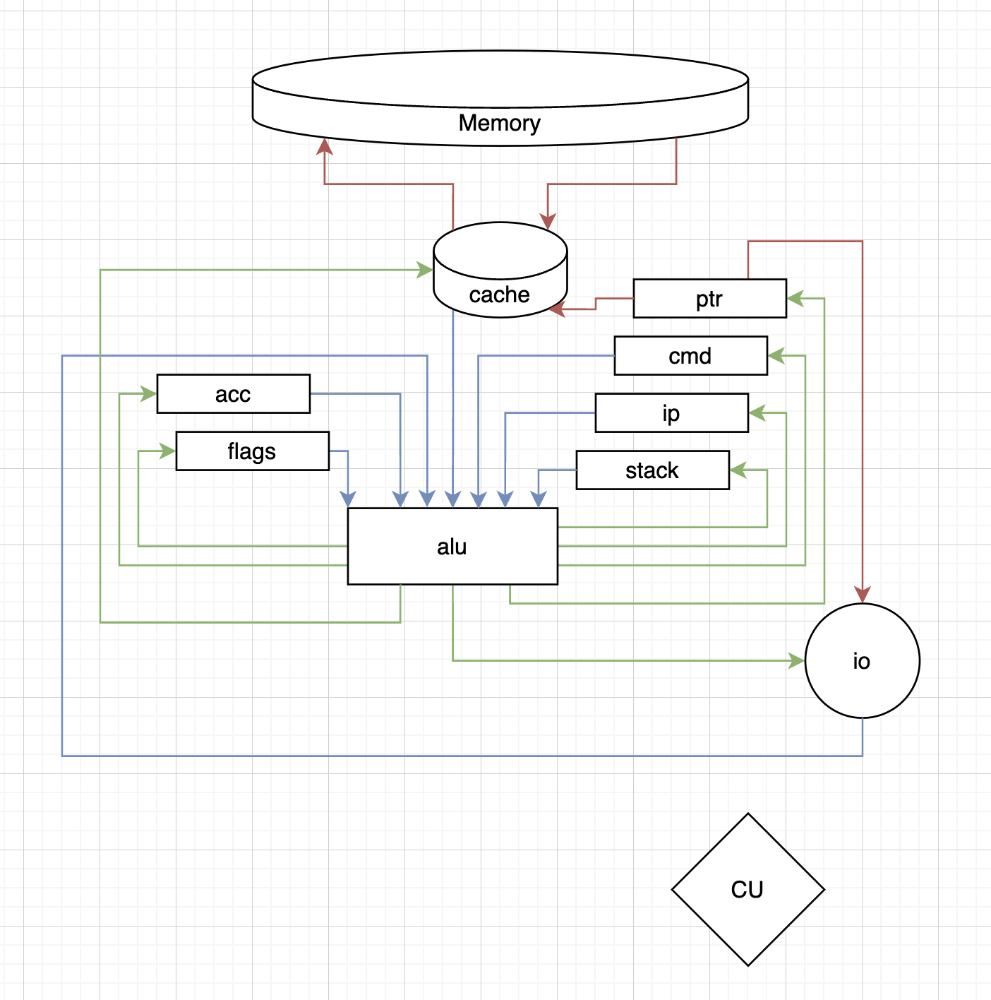

# CSA-lab3

Мацюк Владимир Николаевич, P3215

```txt
lisp -> asm | acc | neum | hw | instr | struct | stream | port | pstr | prob2 | cache
```

С усложнением

## Язык программирования

### Синтаксис

```bnf
<program> ::= <expression>
<expression> ::= <item> | <item> <expression>
<item> ::= <atom> | "(" <item> ")"
<atom> ::= <int-literal> | <id-literal> | <str-literal>
<int-literal> ::= <digit> | <digit> <int-literal>
<id-literal> ::= <id-char> | <id-char> <id-literal>
<str-literal> ::= "'" <str-char> | <str-char> <str-literal> "'"
```

### Семантика

Выполнение программы выполняется сверху-вниз, программа состоит из выражений. Выражение состоит из идентификатора и списка аргументов. Идентификатор указывает на действие, которое должен выполнить транслятор.

Входные параметры выражения:

- Текущий контекст (scope)
- Аргументы

В результате выполнения выражения происходит:

- Изменение текущего контекста
- Возврат значения

У всех выражений есть тип.

На момент старта выполнения программы язык определяет следующие действия:

| Действие                  | Описание                                  |
| ------------------------- | ----------------------------------------- |
| (set id val) -> undefined | Устанавливает значение в текущий контекст |
| (get id) -> val           | Получает значение из текущего контекста   |
| (err e) -> undefined      | Сообщает языку об ошибке                  |
| (if с t f) -> val         | возвращает выражение в зависимости от c   |
| (def id args body)        | Объявление макроса                        |

стратегия вычислений,

области видимости,
типизация, виды литералов.

Данного описания должно быть достаточно для выполнения программы "на листе бумаги".

## Организация памяти

Данный раздел является сквозным по отношению к работе и должен включать:

модель памяти процессора, размеры машинного слова, варианты адресации;
механику отображения программы и данных на процессор.

Модель памяти должна включать:

Какие виды памяти и регистров доступны программисту?
Где хранятся инструкции, процедуры и прерывания?
Где хранятся статические и динамические данные?

       Registers

+------------------------------+
| acc |
+------------------------------+

       Instruction memory

+------------------------------+
| 00 : jmp N |
| ... |
| 10 : interruption vector 0 |
| 11 : interruption vector 1 |
| ... |
| n : program start |
| ... |
| i : interruption handler 0 |
| i+1 : interruption handler 0 |
| ... |
+------------------------------+

          Data memory

+------------------------------+
| 00 : constant 1 |
| 01 : constant 2 |
| ... |
| l+0 : num literals |
| l+1 : num literals |
| ... |
| c+0 : variable 1 |
| ... |
+------------------------------+
А также данный раздел должен включать в себя описание того, как происходит работа с 1) литералами, 2) константами, 3) переменными, 4) инструкциями, 5) процедурами, 6) прерываниями во время компиляции и исполнения. К примеру:

В каких случаях литерал будет использован при помощи непосредственной адресации?
В каких случаях литерал будет сохранён в статическую память?
Как будут размещены литералы, сохранённые в статическую память, друг относительно друга?
Как будет размещаться в память литерал, требующий для хранения несколько машинных слов?
В каких случаях переменная будет отображена на регистр?
Как будет разрешаться ситуация, если регистров недостаточно для отображения всех переменных?
В каких случаях переменная будет отображена на статическую память?
В каких случаях переменная будет отображена на стек?
И так далее по каждому из пунктов в зависимости от варианта...

## Система команд



Control signals:

Instruction Set:

| Instruction | control signals                   | code              |     |
| ----------- | --------------------------------- | ----------------- | --- |
| nop         |                                   | -                 |     |
| halt        |                                   | flags.run = false |     |
| add_i64     | in_acc in_mem out_acc alu_add_i64 | acc = acc + mem   |     |
| out         | in_acc out_io out_acc             | io += acc & 0xff  |     |

- alu:
  - add_i64
- in:
  - in_acc
  - in_flags ?
  - in_mem
  - in_io
  - in_cmd
  - in_ip
- out:
  - out_acc
  - out_flags ?
  - out_ptr
  - out_cmd
  - out_ip
  - out_io
  - out_mem

Процессор 64-битный.
Регистры (все 64-битные):

| Регистр | описание                |
| ------- | ----------------------- |
| acc     | аккумулятор             |
| res     | аккумулятор             |
| ip      | счетчик инструкций      |
| stream  | дескриптор ввода/вывода |
| mem     | указатель памяти        |
| run     | работает ли процессор   |

| address | content                 |
| ------- | ----------------------- |
| 0xff    | ret                     |
| 0xff    | ret                     |
| 0xff    | var1                    |
| 0xff    | var2                    |
| 0xff    | var3                    |

<!-- Раздел должен включать:

Особенности процессора (всё необходимое для понимания системы команд):

типы данных и машинных слов;
устройство памяти и регистров, адресации;
устройство ввода-вывода;
поток управления и системы прерываний;
и т.п.

Набор инструкций.
Способ кодирования инструкций:

по умолчанию можно использовать современные структуры данных;
требование бинарного кодирования -- особенность конкретного варианта.

Описания системы команд должно быть достаточно для её классификации (CISC, RISC, Acc, Stack). -->

## Транслятор

Раздел подразумевает разработку консольного приложения:

Входные данные:

Имя файла с исходным кодом в текстовом виде.
Имя файла для сохранения полученного машинного кода.
Другие аргументы командной строки (ключи, настройки, и т.п.).

Выходные данные:

Имя выходного файла для машинного кода.

Раздел должен включать описание:

Интерфейса командной строки.
Принципов работы разработанного транслятора (этапы, правила и т.п.).

## Модель процессора

Раздел подразумевает разработку консольного приложения:

Входные данные:

Имя файла для чтения машинного кода.
Имя файла с данными для имитации ввода в процессор.

Выходные данные:

Вывод данных из процессора.
Журнал состояний процессора, включающий:

состояния регистров процессора;
выполняемые инструкции (возможно, микрокод) и соответствующие им исходные коды;
ввод/вывод из процессора.

Раздел должен включать:

Схемы DataPath и ControlUnit, описание сигналов и флагов:

В случае, если схемы DataPath и ControlUnit совмещены, должна быть убедительная аргументация в тексте отчёта.
Не стоит полностью отрисовывать сигнальные линии от ControlUnit ко всем элементам схемы, это загромождает схему и усложняет её чтение. Обозначьте их как сделано в примере.
Если вы настаиваете на полной отрисовке сигнальных линий, то они должны визуально отличаться от линий передачи данных / адресов.
Схемы должны помещаться на экран.
В случае, если схемы не соответствуют данным требованиям, они могут быть признаны нечитаемыми, следовательно, непроверяемыми. Пример нечитаемой схемы: link

Особенности реализации процесса моделирования.

Обратите внимание, что схемы должны отражать аппаратную структуру процессора и его элементов. Делайте схемы читаемыми. На структурных элементах отображайте порты (если у вас две стрелки в регистр -- это ошибка), не забывайте мультиплексоры.
Рекомендации по реализации:

строгое разделение DataPath и ControlUnit на уровне кода/интерфейсов/схем;
реализация машинной арифметики на уровне схем не требуется, просто складывайте, вычитайте, умножайте и делите так, как будто это поддержано АЛУ за один такт;
при моделировании процессов ориентироваться на схему процессора и её функционирование (а не писать отвлечённый код).

## Тестирование

Раздел должен включать:

Краткое описание разработанных тестов.

Описание работы настроенного CI.

Реализацию следующих алгоритмов (должны проверяться в рамках интеграционных тестов):

hello -- напечатать hello world;

cat -- печатать данные, поданные на вход симулятору через файл ввода (размер ввода потенциально бесконечен);

hello_user_name -- запросить у пользователя его имя, считать его, вывести на экран приветствие (< -- ввод пользователя через файл ввода, > вывод симулятора):

> What is your name?
> < Alice
> Hello, Alice!

алгоритм согласно варианту;

дополнительные алгоритмы, демонстрирующие особенности вашего варианта (синтаксис, работу специфических команд и т.п.).

Необходимо показать работу разработанных алгоритмов.

Для одной из программ сделать подробное описание с комментариями в рамках отчёта, включая: использование разработанных программ, исходный код, машинный код, результат работы и журнал состояний модели процессора.
Для всех алгоритмов необходимо привести ссылки на их golden тесты. Они должны включать: алгоритм, машинный код и данные, ввод/вывод, журнал работы процессора.
Если размер журнала модели процессора слишком большой (сотни килобайт), его полное включение в golden test нецелесообразно. Необходимо адаптировать журнал под каждый алгоритм, добившись достаточной репрезентативности для проверки задания.
Все листинги исходного кода должны быть отформатированы.

Кроме того, в конце отчёта необходимо привести следующий текст для трёх реализованных алгоритмов (необходимо для сбора общей аналитики по проекту):
| ФИО | <алг> | <LoC> | <code байт> | <code инстр.> | <инстр.> | <такт.> | <вариант> |
где:

алг. -- название алгоритма (hello, cat, или как в варианте)
прог. LoC -- кол-во строк кода в реализации алгоритма
code байт -- кол-во байт в машинном коде (если бинарное представление)
code инстр. -- кол-во инструкций в машинном коде
инстр. -- кол-во инструкций, выполненных при работе алгоритма
такт. -- кол-во тактов, которое заняла работа алгоритма

<!-- # AAA


Архитектура:
    Система команд: acc
    Организация памяти: neum
    Control Unit: hw
    Точность модели: instr
    Представление машинного кода: struct
    Ввод-вывод: stream
    Тип строк: pstr
Алгоритм: prob2
Усложнение: cache

Описание:
    Язык программирования: Lisp. Используется синтаксис S-exp.
    Архитектура:
        Система команд: аккумуляторная. Все операции происходят над аккумулятором.
        Организация памяти: фон Неймановская.
        Control Unit: реализована аппаратно.
        Точность модели: до каждой инструкции.
        Представление машинного кода: в виде структур данных.
        Ввод-вывод: потоковый.
        Тип строк: Pascal-строки (с длиной).
    Алгоритм: вычисление суммы четных чисел Фибоначчи, не превышающих 4 миллиона.
    Усложнение: использование кеш-памяти. Доступ к кешу - 1 такт, к памяти - 10 тактов.

Дополнительные требования:
    Журнал работы процессора:
        Отображать состояние процессора после каждой инструкции.
        Показывать работу с кеш-памятью (в случае усложнения).
    Демонстрация влияния кеш-памяти на производительность:
        Реализовать алгоритм, демонстрирующий работу с кеш-памятью (например, сортировка пузырьком).
        Показать, как размер кеша влияет на его производительность.
Ссылки:
    Fibonacci sequence: <https://en.wikipedia.org/wiki/Fibonacci_sequence> -->
